<h1 align="center">
    

    Projeto de Análise de Dados com o Brazilian E-Commerce Public Dataset 
    

</h1>

## 📌 Descrição dos dados
Este repositório contém as análises e insights extraídos a partir do **Brazilian E-Commerce Public Dataset** <a href="https://www.kaggle.com/datasets/olistbr/brazilian-ecommerce" target="_blank">(Acesse no Kaggle)</a>.  O dataset abrange dados de múltiplos marketplaces no Brasil e oferece a oportunidade de explorar diversas áreas, como comportamento de clientes, desempenho de vendedores, preços de produtos e análises temporais.

### ▶ Esquema de datasets
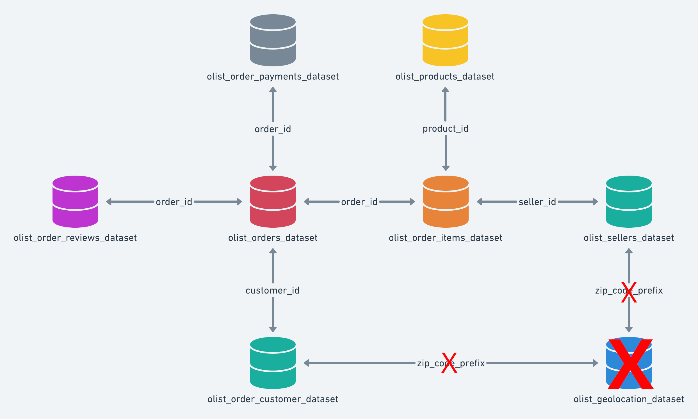

No esquema acima é possível observar que os datasets são interligados por chaves estrangeiras, o que permite realizar `merges` e obter análises mais complexas e interessantes ao combinar diferentes informações.  
<label style="font-weight: bold;">OBS:</label> O conjunto de dados geográfico marcado com o `X` não foi utilizado na em nenhuma análise.

## 🛠️ Ferramentas e Bibliotecas

* **Linguagem:** Python 3.11
* **Ambiente de Desenvolvimento:** Jupyter Lab
* **Gerenciamento de Ambiente:** Miniconda 3
* **Bibliotecas:** Pandas, NumPy, SciPy, Matplotlib e Seaborn

## 🔎 Análises

### Top 10 categorias com maior receita
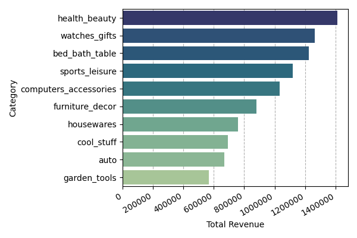

O gráfico acima mostra as 10 categorias com maior receita bruta, ou seja, as que mais venderam somando o preço do item e o valor do frete. É possível observar que a categoria <label style="font-weight: bold;"> health_beauty (beleza e saúde)</label> lidera o ranking, evidenciando uma forte tendência de vida saudável nos últimos anos, como a popularização da academia e produtos fitness.

Podem ocorrer categorias com produtos que são vendidos a preços mais caros, como por exemplo a <label style="font-weight: bold;">watches_gifts (relógios presentes)
 </label> e por isso aparecem de forma alta no ranking.

### Top 10 categorias com menor receita
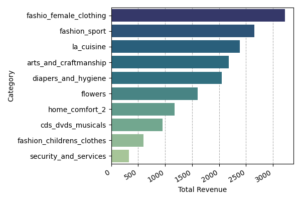

Categorias que possuem pouca receita podem indicar produtos muito baratos, poucos sellers ou categorias muito pouco exploradas.

### Top 10 vendedores com maior receita
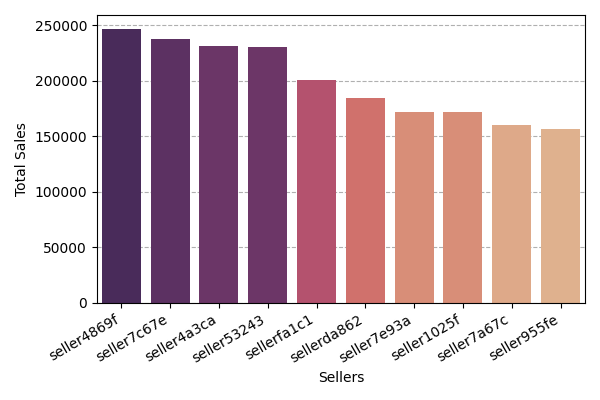

### Cidades com maior receita
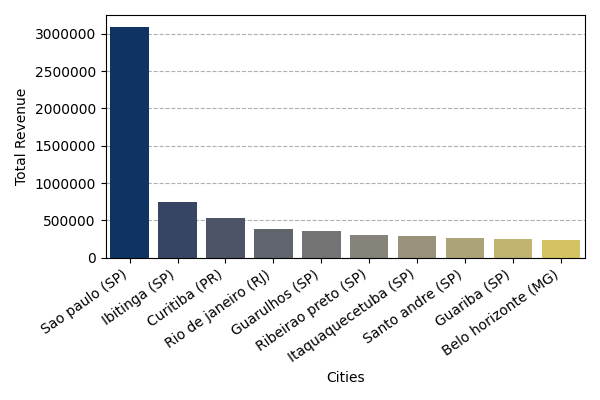

### Estados com maior receita
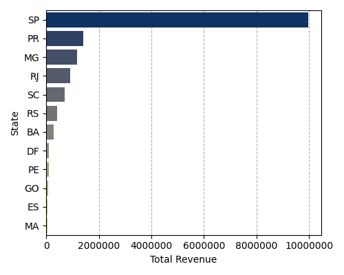

Podemos fazer uma análise agregada dos 3 gráficos acima, onde é possível observar  <label style="font-weight: bold;">cidades do Estado de São Paulo</label> dominando o ranking de cidades com maior receita, como a grande São Paulo, Ibitiga, Guarlhos, entre outros o que é confirmado no gráfico de Estados com maior receita, onde SP é disparado o líder do ranking, seguido por Paraná e Minas Gerais.

### Top 6 produtos com maior quantidade de vendedores
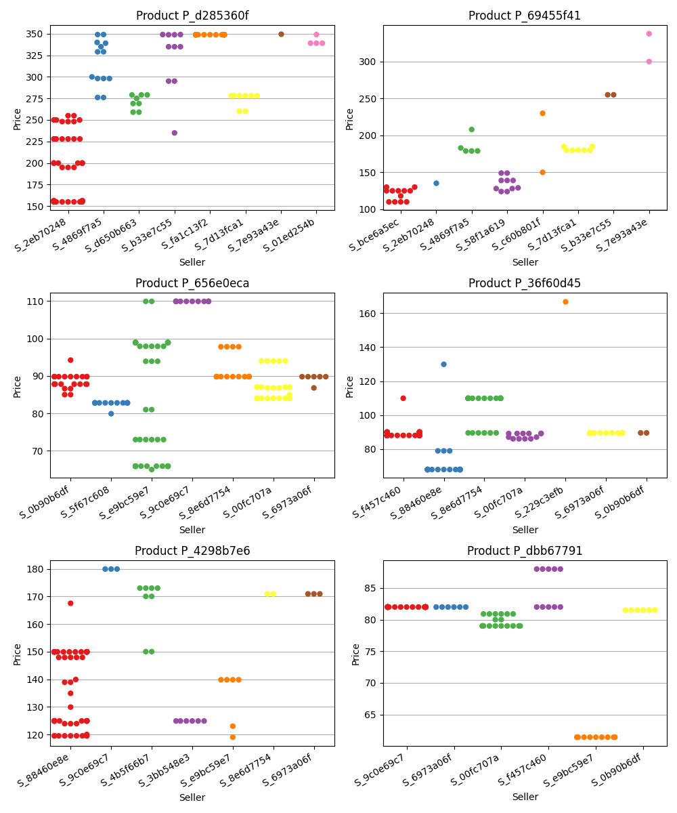

Nesse subplot, é possível observar os produtos com maior quantidade de vendedores, onde cada gráfico representa um produto, sendo no eixo X os os seus respectivos sellers, no eixo Y o preço praticado entre eles. Esse é um gráfico chamado <label style="font-weight: bold;">Swarmplot</label>, muito interessante para visualizar pontos distintos em um eixo, pois nesse caso, cada ponto representa o preço praticado do produto por um seller, possibilitando visualizar além dos produtos que mais possuem vendedores, mas também o preço praticado por eles. 

Um vendedor pode vender o mesmo produto por diferentes preços em diferentes épocas do ano. Em alguns produtos, é possível observar que existe uma grande diferença do valor mínimo e máximo vendido. Por exemplo, no gráfico do  <label style="font-weight: bold;">produto P_69455f41 (2º coluna, 1º linha)</label>, é possível observar uma grande diferença de preço praticado entre o primeiro seller  <label style="font-weight: bold;">S_nce6a5ec</label>, com valores abaixo de R$ 150,00, e o  <label style="font-weight: bold;">seller S_7e93a43e </label> vendendo o mesmo produto com valores acima dos R$ 300,00.

### Vendedores com maiores reviews baseado na quantidade de vendas
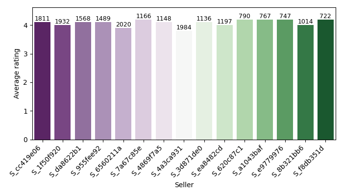

Esse gráfico possibilita o entendimento dos vendedores que possuem os melhores reviews, mas como pode-se imaginar, existe um problema a se tratar quando se lida com uma nota como review, que é o <label style="font-weight: bold;">balanceamento de quantidade de reviews x nota média</label>. Podemos pensar o seguinte: 

- Como podemos considerar vendedores que venderam menos, mas que possuem alta nota média, sem excluir os que venderam muito e que também possuem uma nota alta, que pode ser distorcida pela média? Um vendedor que recebeu apenas 2 reviews nota 5.0 pode parecer perfeito, mas outro vendedor com  <label style="font-weight: bold;">200 reviews nota 4.8 provavelmente é mais consistente e confiável</label>.

O questionamento acima pode ser tratado com uma simples fórmula que representa o score ponderado daquele vendedor, afim de ranqueá-lo.

- <label style="font-weight: bold;">Score = Média de Reviews x Log2(Número de Review)</label>

A fórmula leva em conta tando a média de reviews como o número de reviews que o seller recebeu, tendo o <label style="font-style: italic;">log</label> um papel fundamental, pois ele cresce lentamente a medida que o número de reviews aumenta, ou seja, cresce rápido no início (diferencia bem entre 1, 2, 4, 8 reviews), depois, vai achatando (a diferença entre 100 e 200 reviews não pesa tanto quanto entre 1 e 10). Assim,  <label style="font-weight: bold;">o log evita que apenas grandes vendedores dominem o ranking, mas também não deixa pequenos vendedores com poucos reviews e média alta ficarem artificialmente no topo.</label>

No gráfico é possível observar que os sellers tem nota semelhante por volta de 4, mas com diferentes quantidades de vendas (<label style="font-weight: bold;">lrepresentadas pelos números acima das barras</label>).

### Correlação entre o número de vendas e o número de reviews por seller
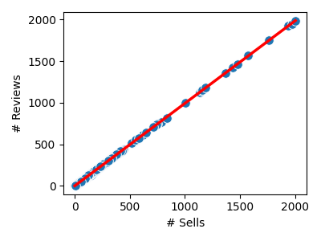

A ideia aqui é verificar se há correlação entre o número de reviews realizadas para o seller e o número de vendas, isso porque, há algumas vendas que não possuem nenhum tipo de review. Como esperado, a correlação é bem alta, evidenciada também de forma estatística:

- <label style="font-weight: bold;">Pearson Correlation Coefficient:</label> 0.999976730275878
- <label style="font-weight: bold;">P-value:</label> 0.0

Com um p-value < 0.05, tem-se que que a correlação de Pearson de 0.99 é estatisticamente significante. 

### A presença de uma review escrita influencia na nota?

#### Com mensagem de review
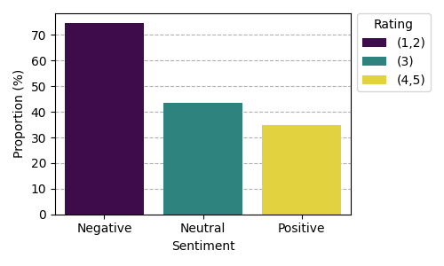

Para complementar a análise anterior, foi interessante verificar que a presença de uma review escrita, ou seja, reviews em que o cliente escreveu um texto para avaliar, é um recurso mais utilizado para <label style="font-weight: bold;">reviews negativas (notas 1 e 2) e neutras (3)</label>, que em algum contexto também pode ser considerado negativa. Isso pode exaltar que a frustração de algumas pessoas com o seu pedido as levem a escrever uma review escrita.

#### Sem mensagem de review
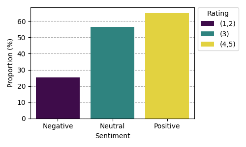

Como esperado, reviews sem mensagem são majoritariamente <label style="font-weight: bold;">positivas (notas 4 e 5)</label>.

### Os produtos tiveram inflação ao longo do tempo?

Análises temporais são muito importantes para descobrir padrões ao decorrer do tempo, como por exemplo, sazonalidade. Nesse caso, foi importante para analisar se um produto único teve inflação ao longo do tempo. Então, a estratégia foi capturar os produtos mais vendidos pelos vendedores e visualizar se houve inflação do preço do produto a medida que o tempo passou.

#### Produto P_656e0eca
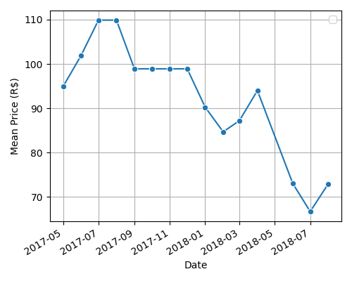

O <label style="font-weight: bold;">produto P_656e0eca</label> aparece com o preço aproximado de R$ 96,00 reais em 05/2017, atingindo o seu pico de R$ 110,00 entre 07/2017 e 09/2017 e foi tendo quedas graduais de preço até atingir o preço de aproximadamente R$ 73,00 em meados do mês 08/2018. Portanto, considerado o pico de venda, <label style="font-weight: bold;">o produto teve uma queda no valor de aproximadamente 34%</label>.

#### Produto P_d285360f
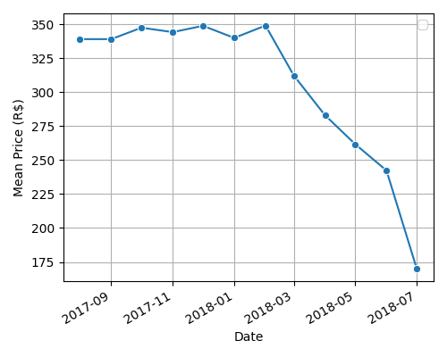

O <label style="font-weight: bold;">produto P_d285360f</label> aparece com o preço aproximado de R$ 340,00 reais em 09/2017, tendo poucas variações de preço até o mês 02/2018 onde atinge o pico de R$ 350,00, mas a partir disso, o preço despenca atingindo o menor valor de R$ 173,00 em 07/2017. Portanto, considerando o pico de venda, <label style="font-weight: bold;">o produto não teve inflação e sim uma queda de aproximadamente 49%</label>.

#### Produto P_e0d64dcf
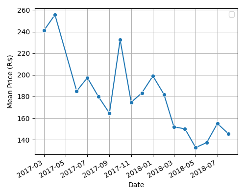

O <label style="font-weight: bold;">produto P_d285360f</label> teve uma grande variação de preço, o seu pico é no mês 04/2017 com valor aproximado de R$ 255,00, logo após tendo uma grande queda, logo após voltando a ter uma subida significante em 10/2017 com valor de R$ 237,00, atingindo o seu menor valor em 05/2018 com aproximadamente R$ 137,00, finalizando a análise com o útlimo valor de R$ 142,00 em 08/2018. Portanto, <label style="font-weight: bold;">o produto teve uma queda aproximadamente 56%<label>.