<h1 align="center">
    

    Projeto de Análise de Dados com o Brazilian E-Commerce Public Dataset 
    

</h1>

## 📌 Descrição dos dados
Este repositório contém as análises e insights extraídos a partir do **Brazilian E-Commerce Public Dataset** <a href="https://www.kaggle.com/datasets/olistbr/brazilian-ecommerce" target="_blank">(Acesse no Kaggle)</a>.  O dataset abrange dados de múltiplos marketplaces no Brasil e oferece a oportunidade de explorar diversas áreas, como comportamento de clientes, desempenho de vendedores, preços de produtos e análises temporais.

### ▶ Esquema de datasets
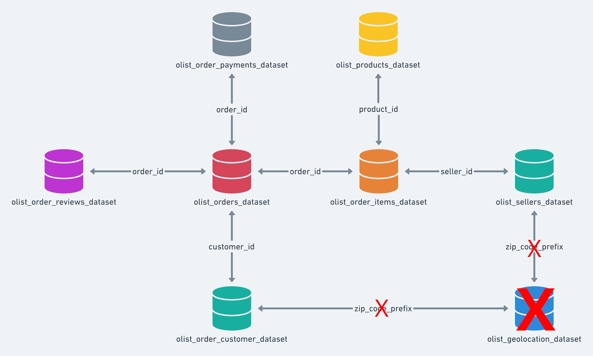

No esquema acima é possível observar que os datasets são interligados por chaves estrangeiras, o que permite realizar `merges` e obter análises mais complexas e interessantes ao combinar diferentes informações.  
<label style="font-weight: bold;">OBS:</label> O conjunto de dados geográfico marcado com o `X` não foi utilizado na em nenhuma análise.

## 🛠️ Ferramentas e Bibliotecas

* **Linguagem:** Python 3.11
* **Ambiente de Desenvolvimento:** Jupyter Lab
* **Gerenciamento de Ambiente:** Miniconda 3
* **Bibliotecas:** Pandas, NumPy, SciPy, Matplotlib e Seaborn

## 🔎 Análises

### Top 10 categorias com maior receita
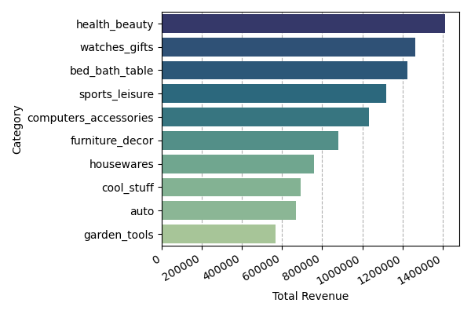

### Top 10 categorias com menor receita
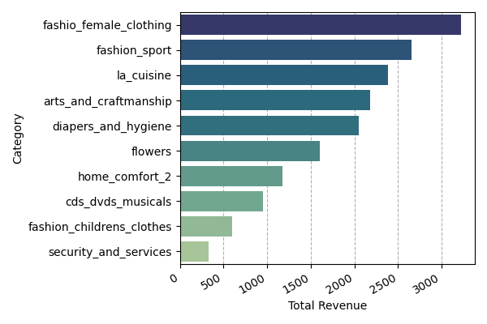

### Top 10 vendedores com maior receita
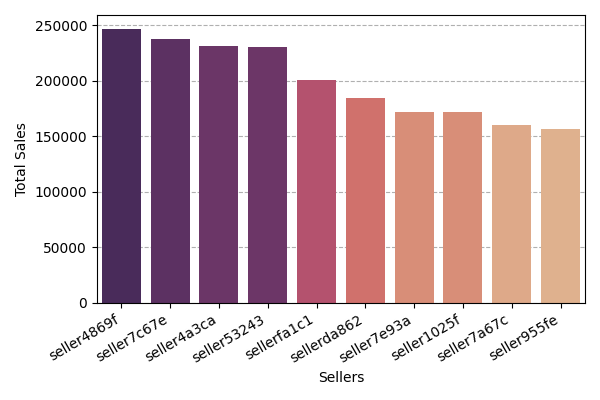

### Top 6 produtos com maior quantidade de vendedores
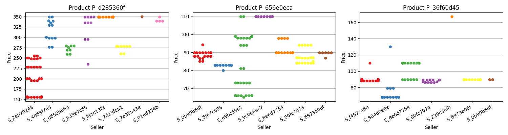

### Vendedores com maiores reviews baseado na quantidade de vendas
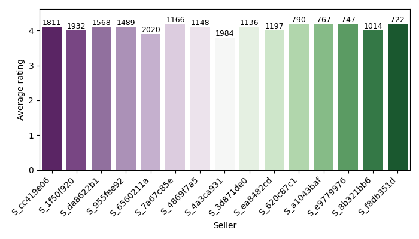

### Correlação entre o número de vendas e o número de reviews por seller
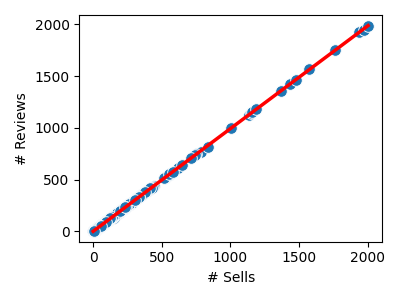

### A presença de uma review escrita influencia na nota?

#### Com mensagem de review
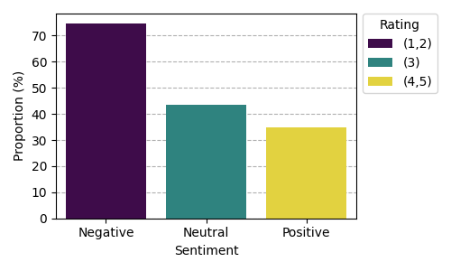

#### Sem mensagem de review
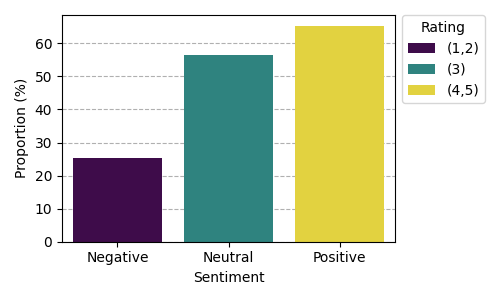

### Cidades com maior receita
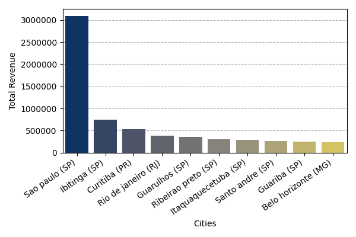

### Estados com maior receita
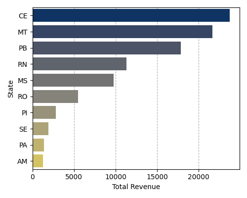

### Os produtos tiveram inflação ao longo do tempo?

#### Produto P_656e0eca
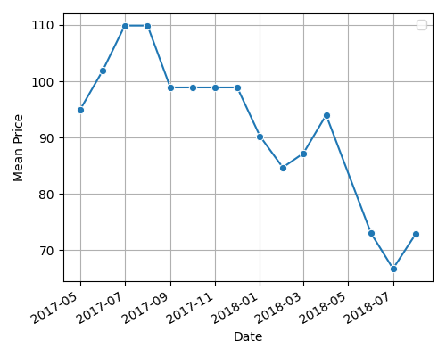

#### Produto P_d285360f
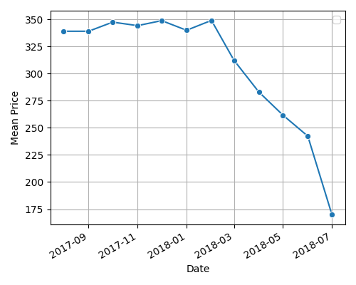

#### Produto P_e0d64dcf
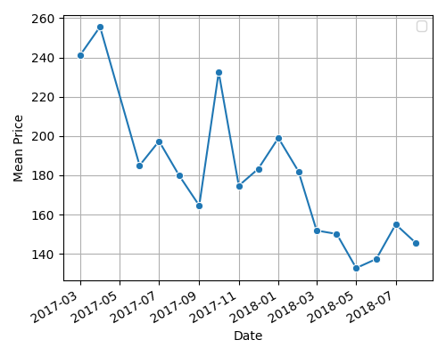